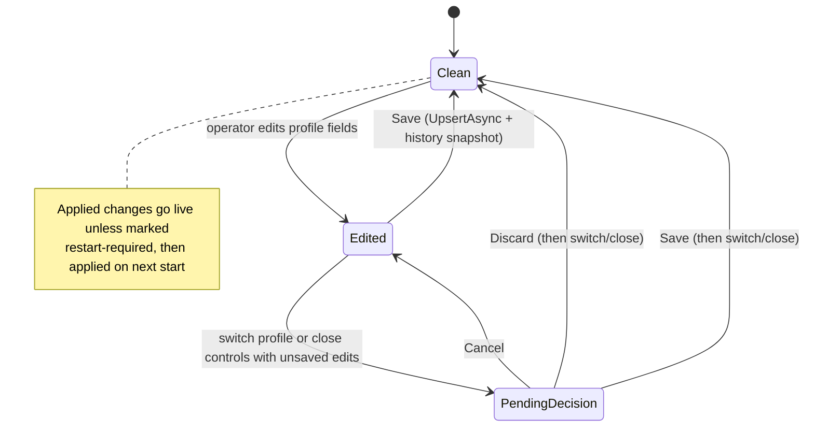
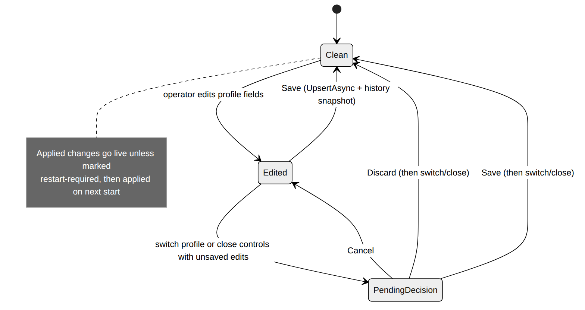

# Config Profile Changes

Configuration in Quasar is file-backed JSON edited through profiles. While an
operator edits a profile, the page holds unsaved changes; attempting to switch
profiles or use the modal close controls with pending edits raises a decision
dialog (Cancel / Discard / Save). Saved changes are written atomically with a
timestamped history snapshot.

Relevant source:
[`ConfigProfilePendingChangesDialog.razor`](../../Quasar/Components/Pages/ConfigProfilePendingChangesDialog.razor),
[`ConfigsPageDialog.razor`](../../Quasar/Components/Pages/ConfigsPageDialog.razor),
[`QuasarConfigProfileCatalog.cs`](../../Quasar/Services/QuasarConfigProfileCatalog.cs),
[`Configs.razor`](../../Quasar/Components/Pages/Configs.razor).

| State | Meaning |
| --- | --- |
| `Clean` | The editor matches the persisted profile. |
| `Edited` | Unsaved edits exist in the editor. |
| `PendingDecision` | The operator tried to switch profiles or use the config profile modal close controls with unsaved edits; the dialog offers `Cancel` (stay, keep edits), `Discard` (lose edits, continue), or `Save` (persist, then continue). |

**Persistence.** `QuasarConfigProfileCatalog.UpsertAsync` normalizes and writes
`{ProfilesDir}/{id}/profile.json` plus a `History/{timestamp}.json` snapshot
(atomic swap). External edits to the JSON are picked up by a debounced
file-watch reload (`ScheduleReload`).

**World-template import.** The world-template UI can derive a new config profile
from a template's current `Sandbox_config.sbc`. It imports DS-visible session
settings and workshop mods, then persists the result through the same
`UpsertAsync` path.

**Live vs restart-required.** Changes that the running server/agent can apply
dynamically go live immediately; changes flagged restart-required are applied on
the next server start via reconciliation (see
[Dedicated Server Lifecycle](DedicatedServerLifecycle.md)).

---

## Related

- [Architecture › Configuration Management](../QuasarArchitecture.md#configuration-management)
- Back to the [State Machine Index](Index.md).
