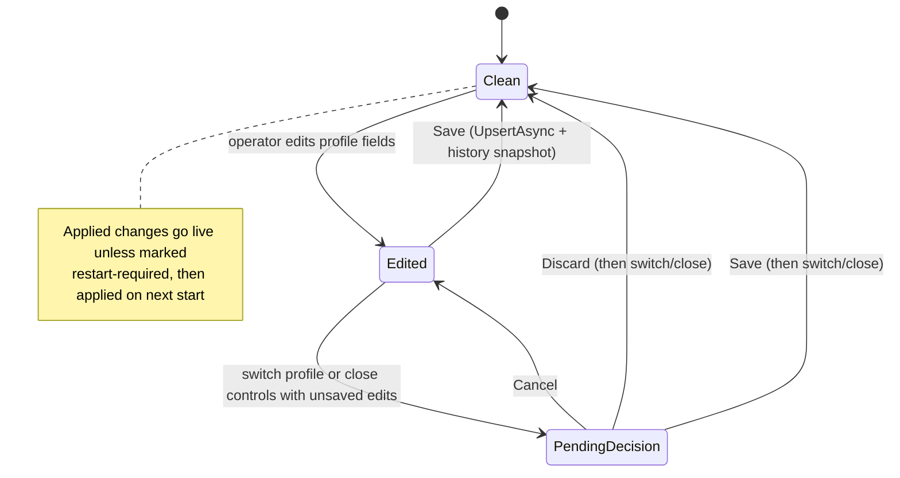
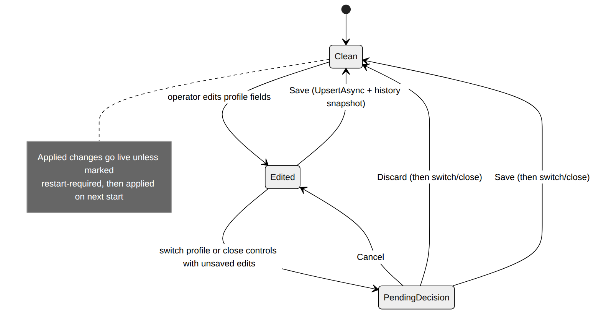

# Config Profile Changes

Configuration in Quasar is file-backed JSON edited through profiles. While an
operator edits a profile, the page holds unsaved changes; attempting to switch
profiles or use the modal close controls with pending edits raises a decision
dialog (Cancel / Discard / Save). Saved changes are written atomically with a
timestamped history snapshot.

Relevant source:
[`ConfigProfilePendingChangesDialog.razor`](../../Quasar/Components/Pages/ConfigProfilePendingChangesDialog.razor),
[`ConfigsPageDialog.razor`](../../Quasar/Components/Pages/ConfigsPageDialog.razor),
[`QuasarConfigProfileCatalog.cs`](../../Quasar/Services/QuasarConfigProfileCatalog.cs),
[`Configs.razor`](../../Quasar/Components/Pages/Configs.razor).

```mermaid
stateDiagram-v2
    [*] --> Clean
    Clean --> Edited: operator edits profile fields
    Edited --> Clean: Save (UpsertAsync + history snapshot)
    Edited --> PendingDecision: switch profile or close controls with unsaved edits
    PendingDecision --> Edited: Cancel
    PendingDecision --> Clean: Discard (then switch/close)
    PendingDecision --> Clean: Save (then switch/close)
    note right of Clean
        Applied changes go live unless marked
        restart-required, then applied on next start
    end note
```

| State | Meaning |
| --- | --- |
| `Clean` | The editor matches the persisted profile. |
| `Edited` | Unsaved edits exist in the editor. |
| `PendingDecision` | The operator tried to switch profiles or use the config profile modal close controls with unsaved edits; the dialog offers `Cancel` (stay, keep edits), `Discard` (lose edits, continue), or `Save` (persist, then continue). |

**Persistence.** `QuasarConfigProfileCatalog.UpsertAsync` normalizes and writes
`{ProfilesDir}/{id}/profile.json` plus a `History/{timestamp}.json` snapshot
(atomic swap). External edits to the JSON are picked up by the shared debounced
file watcher. Mod arrays are order preserving; the saved
order becomes the Space Engineers mod load order when Quasar rewrites
`Sandbox_config.sbc` during server preparation. On profile open, before saving
profile edits, and during world-template/server-editor mod imports, Quasar
expands declared Steam Workshop dependencies and marks dependency rows with
`IsDependency` without reordering existing rows. That flag is imported from and
written to `Sandbox_config.sbc` mod entries. The Mods tab's **Auto Sort
Dependencies** action applies the topological sort explicitly. The resolver
warns when a dependency/dependent pair is currently out of order, sees a
circular dependency chain, or cannot satisfy a dependency edge after sorting.
Successful dependency checks also refresh a collapsed, flattened dependency
outline in the Mods tab; that view is derived UI state and is not saved into
the profile JSON. The DS `AutodetectDependencies` root setting is hidden from
the world-options UI and managed from these results: Quasar disables it after a
clean check or successful sort, and enables it when dependency state is
unchecked or unresolved warnings remain.

Opening the Mods tab refreshes selected mod display names from Steam Workshop as
pending editor changes. The refresh preserves Workshop IDs, list order, and
dependency flags, and failures leave the stored names intact.

**Profile creation.** Profiles start empty when created directly, or can be
derived by the world-template UI from a template's current `Sandbox_config.sbc`.
Template-derived profiles import DS-visible session settings and workshop mods,
then persist the result through the same `UpsertAsync` path. Quasar does not
seed or restore built-in default profiles.

**Live vs restart-required.** Changes that the running server/agent can apply
dynamically go live immediately; changes flagged restart-required are applied on
the next server start via reconciliation (see
[Dedicated Server Lifecycle](DedicatedServerLifecycle.md)).

---

## Related

- [Architecture › Configuration Management](../QuasarArchitecture.md#configuration-management)
- Back to the [State Machine Index](Index.md).
